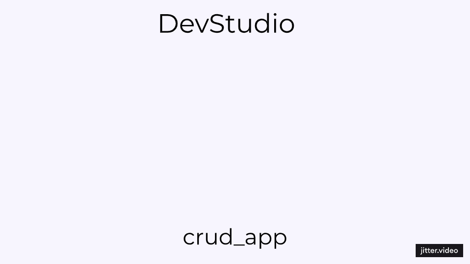

# Flutter Firestore CRUD App

A Flutter application demonstrating CRUD (Create, Read, Update, Delete) operations with Firebase Firestore for managing products.

🔧 Built with Flutter, Firebase, and Material Design.

## 📽 Preview

## Features

- ✨ **Firebase Integration**: Utilizes Firebase Firestore for real-time database operations.
- 📝 **CRUD Operations**: Enables users to add, update, delete, and paginate through product data.
- 🖼️ **Material Design**: Follows Flutter's Material Design principles for consistent and intuitive UI/UX.

## Usage

- **Modify** lib/services/firestore_service.dart to update Firestore service methods according to your database structure and needs.
- **Customize** UI components in lib/screens/products_screen.dart to match your design requirements.
- **Test** and debug the app locally to ensure all CRUD operations work correctly.
Contributing

## Contributions are welcome! Please fork the repository and submit a pull request with your improvements.

## License

This project is licensed under the MIT License

## About the Developer 🌟

**👨‍💻Mo'men M.** is passionate about creating efficient and user-friendly mobile applications. With expertise in Flutter and Firebase, Mo'men focuses on delivering robust solutions that enhance user experiences and meet business objectives.

- 🌐 Website: [mmdev.studio](https://mmdev.studio/)
- 💼 LinkedIn: [mm-devstudio](https://www.linkedin.com/in/mm-devstudio/)
- 📸 Instagram: [devstudio_mm](https://www.instagram.com/devstudio_mm/)
- 📝 Upwork: [Mo'men M. on Upwork](https://upwork.com/freelancers/mo2men184)
- 💻 Freelancer: [devmo2 on Freelancer](https://www.freelancer.com/u/devmo2)
- 📧 Email: [dev.moamen.sr@gmail.com](mailto:dev.moamen.sr@gmail.com)

